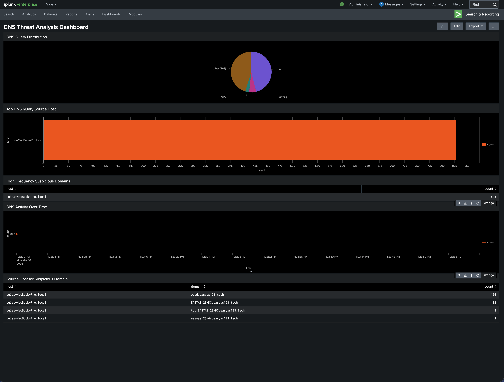
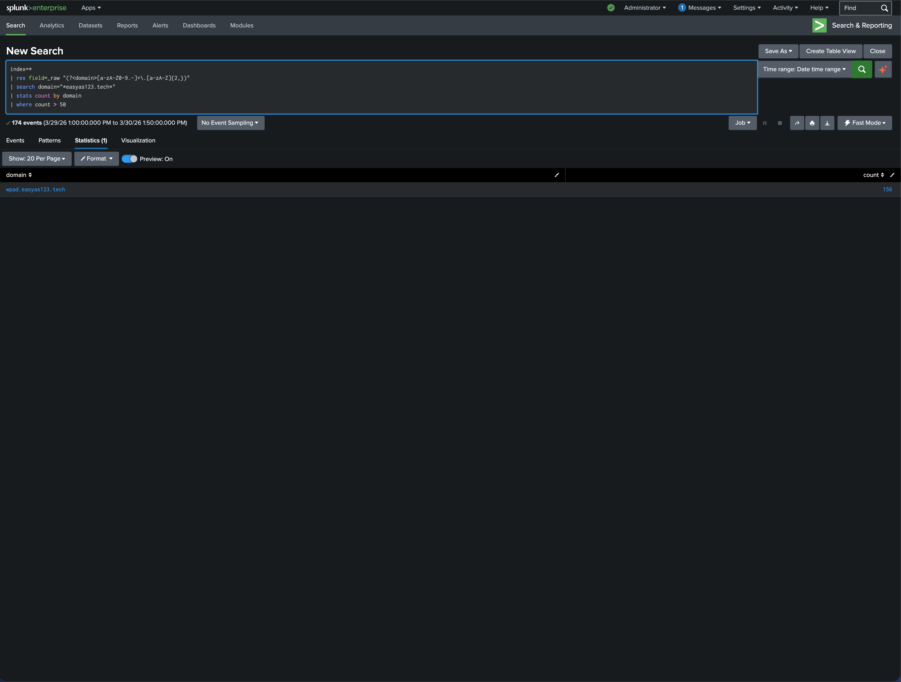
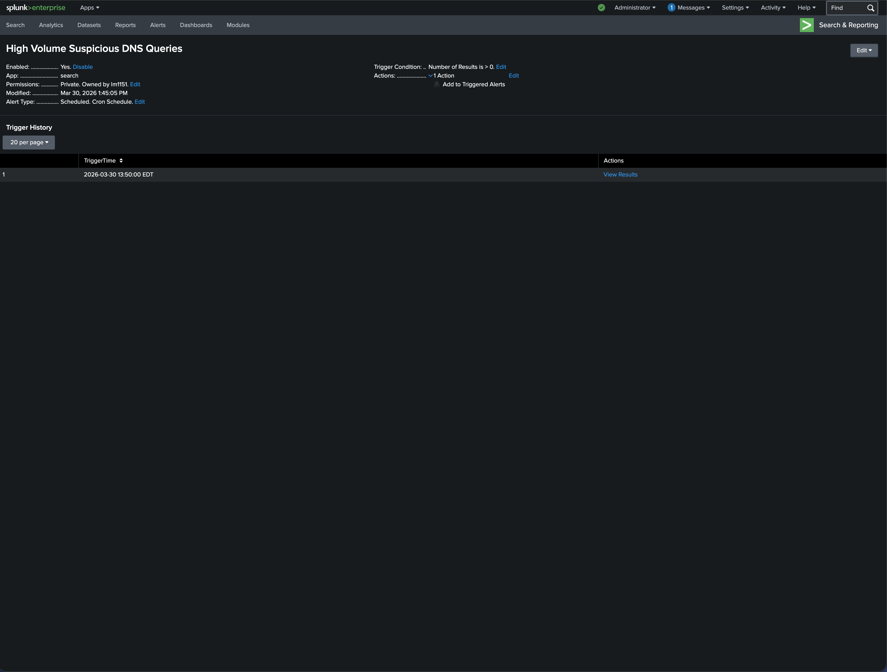

# splunk-dns-threat-detection

# Splunk DNS Threat Detection Project

## Overview
This project demonstrates how to analyze DNS traffic using Splunk to identify suspicious activity and potential threats.

## Objectives
- Ingest DNS logs into Splunk
- Extract domain names from raw logs
- Identify abnormal DNS query patterns
- Create dashboards to visualize activity
- Build alerts for threat detection

## Tools Used
- Splunk Enterprise
- DNS logs (CSV)
- SPL (Search Processing Language)

## Key Features

### 1. Domain Extraction
Used regex to extract domain names from raw DNS logs:
| rex field=_raw "(?<domain>[a-zA-Z0-9.-]+.[a-zA-Z]{2,})"

### 2. Suspicious Domain Detection
Identified high-frequency DNS queries:
| stats count by domain
| where count > 50

### 3. Dashboard
Created a Splunk dashboard with:
- DNS query distribution
- Top host activity
- Suspicious domain analysis
- DNS activity over time

### 4. Alerting
Built a scheduled alert to detect abnormal DNS behavior:
- Runs every 5 minutes
- Triggers when suspicious domains exceed threshold
- Severity: Medium

## Findings
Detected repeated queries to `wpad.easyas123.tech`, which may indicate automated beaconing or suspicious DNS activity.

## Screenshots

### Dashboard

### Domain Count Analysis

### Query Frequency Analysis

## Conclusion
This project demonstrates practical SIEM usage, including log ingestion, detection engineering, and alert creation.
